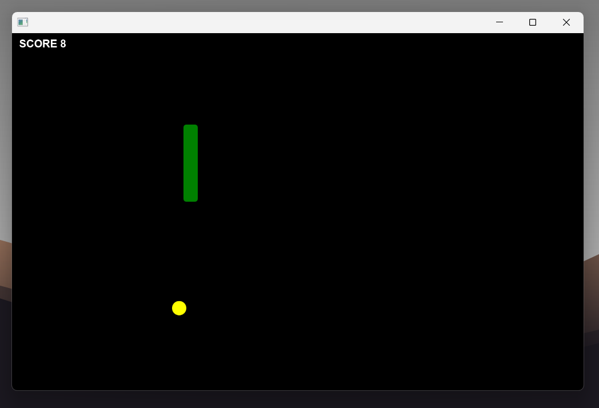
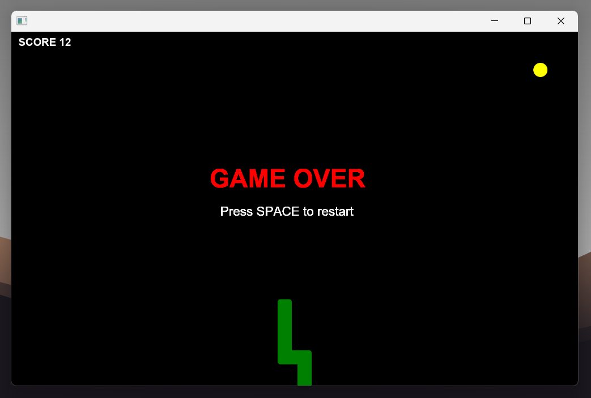

# 🐍 JavaFX Snake Game

A modern, smooth-gliding take on the classic Snake arcade game built entirely in Java using JavaFX.

Unlike traditional grid-based snake games, this version runs at a smooth 60 FPS, providing fluid continuous movement, rounded graphics, and zero-latency sound effects.


---

## Screenshots

|                                  Gameplay                                   |                               Game Over Screen                               |
| :-------------------------------------------------------------------------: | :--------------------------------------------------------------------------: |
|  |  |

---

## Features

- **Smooth Movement Engine:** The snake glides continuously pixel-by-pixel at 60 FPS rather than snapping rigidly to a grid.
- **Special Bonus Food:** A larger, higher-value red food item periodically spawns for a limited time to boost your score.
- **Zero-Latency Audio:** Utilizes native `javax.sound.sampled` buffers for instantaneous sound effects (eating, special eating, and game over) without the standard JavaFX media engine delay.
- **Smart Self-Collision:** Advanced collision logic that accounts for continuous movement, preventing unfair "neck crashes" on tight turns.
- **Dynamic Growth:** The snake's tail smoothly extrudes and elongates as food is eaten.
- **Pause & Resume:** Instantly pause the game at any moment using the Escape key.
- **Live Score Tracking:** On-screen UI overlay keeps track of the player's score.
- **Instant Replay:** Quick-restart functionality via the Spacebar keeps the gameplay loop continuous.

---

## Controls

| Key                | Action                         |
| :----------------- | :----------------------------- |
| **⬆️ Up Arrow**    | Move Up                        |
| **⬇️ Down Arrow**  | Move Down                      |
| **⬅️ Left Arrow**  | Move Left                      |
| **➡️ Right Arrow** | Move Right                     |
| **ESC**            | Pause / Resume Game            |
| **Spacebar**       | Restart Game (After Game Over) |

> **Note:** The movement logic includes a safety lock to prevent instantly reversing into yourself.

---

## Getting Started

### Prerequisites

To run this project, you will need:

- **Java JDK 11** or higher.
- **JavaFX SDK** (or run via a build tool like Maven/Gradle that includes JavaFX dependencies).

### Running the Game

1. **Clone the repository:**
   ```bash
   git clone https://github.com/sadudoy/snakegame-javafx.git
   ```

## Author

### SAD IBNA FORID

Bangladesh Army University of Science and Technology, Saidpur
